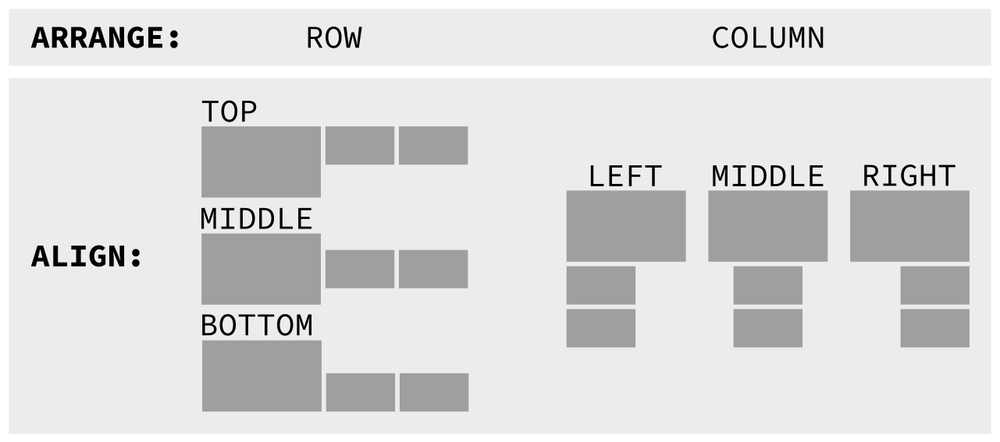

# way-displays: Auto Manage Your Wayland Displays

1. Sets preferred mode or highest at maximum refresh
1. Arranges in a row or a column
1. Auto scales based on DPI: 96 is a scale of 1
1. Reacts when displays are plugged/unplugged
1. Reacts when laptop lid is closed/opened

Works out of the box: no configuration required.

Wayland successor to [xlayoutdisplay](https://github.com/alex-courtis/xlayoutdisplay), inspired by [kanshi](https://sr.ht/~emersion/kanshi/).

<details><summary>"Screenshot"</summary><br>



</details>

See an [example session](doc/example-session.md) for full details.

# Requirements

The wayland compositor must support the WLR (wayland roots) Output Management protocol.

<details><summary>Popular WLR Compositors</summary><br>

* [sway](https://swaywm.org/)
* [hikari](https://hikari.acmelabs.space)
* [Way Cooler](http://way-cooler.org/)
* [Wayfire](https://github.com/WayfireWM/wayfire)
</details>

# Usage

Run once after your wayland compositor has been started. `way-displays` will remain in the background, responding to changes, such as plugging in a display, and will terminate when you exit the compositor.

`way-displays` will print messages to inform you of everything that is going on.

<details><summary>sway config</summary><br>

[sway](https://swaywm.org/) will start way-displays once on startup via the `exec` command. See `man 5 sway`.

Remove any `output` commands from your sway config file and add the following:
```
exec way-displays > /tmp/way-displays.${XDG_VTNR}.${USER}.log 2>&1
```

Look at `/tmp/way-displays.1.me.log` to see what has been going on.

</details>

# Configuration

See the [default cfg.yaml](cfg.yaml) installed at `/etc/way-displays/cfg.yaml`.

Quick start:
```
mkdir ~/.config/way-displays
cp /etc/way-displays/cfg.yaml ~/.config/way-displays/cfg.yaml
```

`cfg.yaml` will be monitored for changes, which will be immediately applied.

<details><summary>File Locations</summary><br>

The following are used, in order:
* `$XDG_CONFIG_HOME/way-displays/cfg.yaml`
* `$HOME/.config/way-displays/cfg.yaml`
* `/usr/local/etc/way-displays/cfg.yaml`
* `/etc/way-displays/cfg.yaml`

</details>

<details><summary>ARRANGE and ALIGN</summary><br>

The default is to arrange in a row, aligned at the top of the displays. This is very configurable:


`ARRANGE` may be a `ROW` (left to right) or a `COLUMN` (top to bottom).

`ALIGN` for a `ROW` may be `TOP`, `MIDDLE`, `BOTTOM`.

`ALIGN` for a `COLUMN` may be `LEFT`, `MIDDLE`, `RIGHT`.

Layout to suit you e.g. top to bottom, aligned in the centre:
```yaml
# Arrange displays in a ROW (default, left to right) or a COLUMN (top to bottom)
ARRANGE: COLUMN

# Align ROWs at the TOP (default), MIDDLE or BOTTOM
# Align COLUMNs at the LEFT (default), MIDDLE or RIGHT
ALIGN: MIDDLE
```

</details>

<details><summary>ORDER</summary><br>

The default `ROW` (left to right) or `COLUMN` (top to bottom) `ORDER` is simply the order in which the displays are discovered.

Define your own e.g.:
```yaml
ORDER:
    - 'DP-2'
    - 'Monitor Maker ABC123'
```

</details>

<details><summary>AUTO_SCALE</summary><br>

The default is to scale each display by DPI.

This may be disabled and scale 1 will be used, unless a `SCALE` has been specified.

```yaml
AUTO_SCALE: false
```

</details>

<details><summary>SCALE</summary><br>

Auto scale may be overridden with custom scales for each display e.g.
```yaml
SCALE:
    - NAME_DESC: 'Monitor Maker ABC123'
      SCALE: 1.75
```

</details>

<details><summary>LAPTOP_DISPLAY_PREFIX</summary><br>

Laptop displays usually start with `eDP` e.g. `eDP-1`. This may be overridden if your laptop is different e.g.:
```yaml
LAPTOP_DISPLAY_PREFIX: 'eDPP'
```

</details>

<details><summary>On Names and Descriptions</summary><br>
You can configure displays by name or description. You can find these by looking at the logs e.g.

```
DP-3 Arrived:
    name:     'DP-3'
    desc:     'Unknown Monitor Maker ABC123 (DP-3 via HDMI)'
```

It is recommended to use the description rather than the name, as the name may change over time and will most likely be different on different PCs.

The description does contain information about how it is connected, so strip that out. In the above example, you would use the description `Monitor Maker ABC123`.

</details>

# Installation

## Package Manager

<details><summary>AUR</summary><br>

[way-displays](https://aur.archlinux.org/packages/way-displays/)

Install with your favourite AUR package manager e.g. `pacaur -S way-displays`
</details>

## From Source

<details><summary>Build</summary>

### Dependencies
* gcc
* wayland
* wayland-protocols
* wlroots
* libinput
* yaml-cpp

Most will be available if you are running a wlroots based compositor like sway.

yaml-cpp will need to be installed via your distribution's package manager.

### Build

```
git clone git@github.com:alex-courtis/way-displays.git
cd way-displays
make
```

### Install / Uninstall

```
sudo make install
sudo make uninstall
```
</details>

# On Scale And Blurring

When using a display scale that is not a whole number, the result will not be a pixel perfect rendition of the unscaled content. There are no fractional pixels so there will be rounding and thus some blurring.

To ameliorate this, we always round our scale to a multiple of one eighth. This results in a nice round binary number, which minimises some of the rounding and results in a smoother image. If you're interested, our rounded scale is a [wl_fixed_t](https://wayland.freedesktop.org/docs/html/apb.html).

# On Games And Scale

When a display is scaled (X11) linux games will render at the display's scaled resolution, rather than the monitor's native resolution. There is [work underway](https://gitlab.freedesktop.org/wlroots/wlroots/-/issues/2125) to fix this.

In the meantime, we can work around this by temporarily disabling scaling before starting and playing the game.

1. Set `AUTO_SCALE: TRUE` in your configuration.
1. Add the executable [togglescale](https://github.com/alex-courtis/arch/blob/master/bin/togglescaling) script to your path.
1. Create a compositor keybinding e.g. sway `bindsym $mod+Shift+Ctrl+s exec togglescaling`

# Help, Questions, Suggestions And Ideas

Please create a [github issue](https://github.com/alex-courtis/way-displays/issues).

Attaching the log e.g. `/tmp/way-displays.1.me.log` would be useful.

# Developing

Enhancements and bug fixes are very welcome: please raise a [github issue](https://github.com/alex-courtis/way-displays/issues) or fork this repo and submit a PR.

## Author

Alexander Courtis

## Contributors

Stephen Barratt
